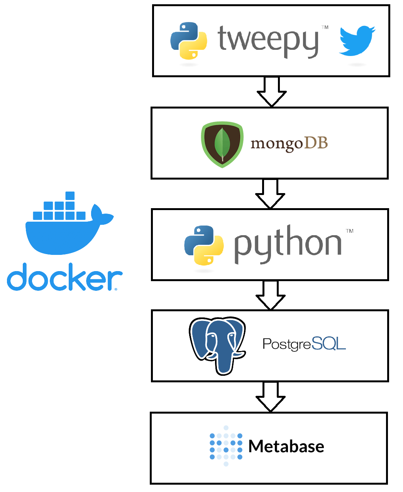

# data_pipeline_tweets
data pipeline with 5 docker containers

## The pipeline

1. **Tweet Listener** with tweepy using twitter livestream for a given topic.
2. **MongoDB** for storing the raw tweets
3. **ETL Executor** regularly extracting tweets, performing a sentiment analysis (<https://github.com/cjhutto/vaderSentiment>) and loading
4. **PostgresSQL** for storing the tweets and the analysis values
5. **Metabase** as endpoint for visualization

## Docker

Everything is encapsulated in docker containers defined in `docker-compose.yml` .

Useful commands:
* `docker-compose up` starting the pipeline
* `docker ps -a` showing current containers
* `docker rm -f $(docker ps -a -q)` deleting all containers
* `http://localhost:3000` to access metabase locally

### Other requirements

* registered twitter developer account for authentification
